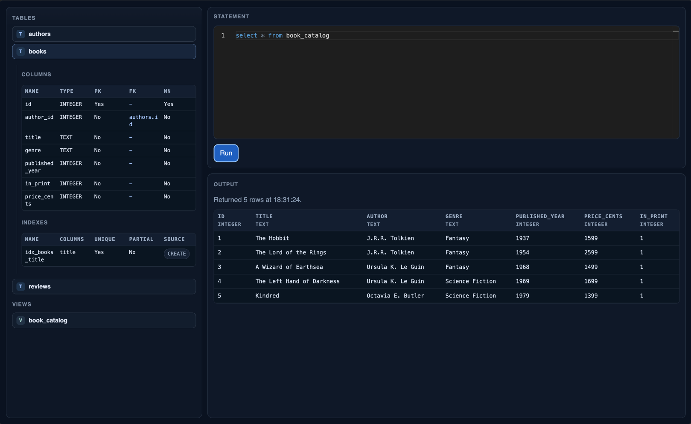

Spring Boot browser SQLite GUI.

- serves at `http://localhost:8080/db`
- shows tables and views 
- displays column and index metadata 
- allows running queries, renders `SELECT` results

## Stack

- Java 19
- Spring Boot 4 (MVC + Thymeleaf)
- JDBC, `sqlite-jdbc`
- HTMX for partial page updates
- Monaco Editor for the SQL editor

## Configuration

`src/main/resources/application.properties`.

```properties
app.sqlite.path=./data/demo.sqlitea
app.sqlite.max-result-rows=200
app.sqlite.seed-if-empty=true
```

